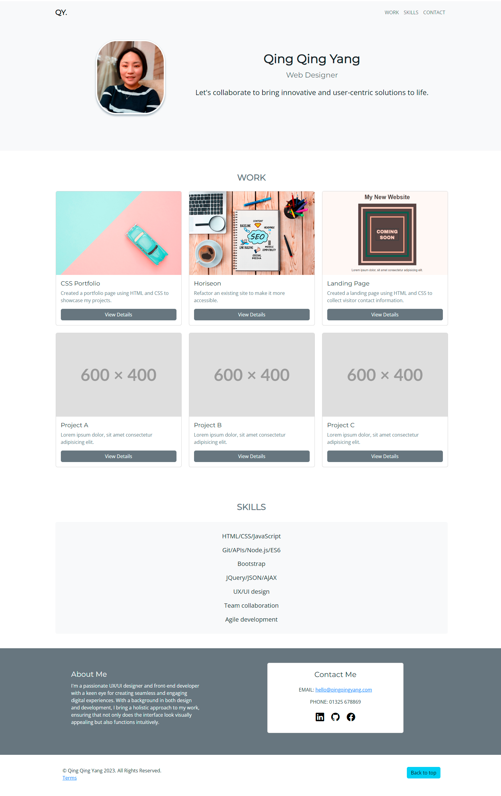

# Bootstrap-Portfolio
Module 3 Challenge: Code Bootstrap Portfolio

## Description 

This Bootstrap-Portfolio was created for bootcamp students who were taking the third week's challenge. In this challenge, I need to build my portfolio layout using the Bootstrap CSS Framework.

The website should contain the following onboarding components to meet critical requirements:

* A Navigation bar   

    -A navigation menu at the top. 

      - Include links that are applicable to your portfolio. 

        - Links should navigate to the appropriate sections 

* A hero section

    - A jumbotron featuring your picture, your name, and any other information you'd like to include.

* A work section

    - A section displaying your work in grid. 

        - If you need to use placeholder image use: https://placehold.co/ 

    - Use bootstrap cards for each project.

        - The description should give a brief overview of the work.

    - Each project will eventually link to your class project work! 

* A skills section

    - List out the skills you expect to learn from the bootcamp.

* An about / contact section.

    - An "About Me" section in the same row.

* A footer section.

    - All hyperlinks should have a hover effect.

    - All buttons should display a box shadow upon hover.

## Installation

N/A

## Usage 

To use this Bootstrap-Portfolio,  you can review each file. 

To check whether my portfolio page meets critical requirements, open the webpage [link](https://qingh2o.github.io/Bootstrap-Portfolio/). 

Once the portfolio web page loads, click on all links and images to test if they work properly. 

The page should look similar to the screenshot below.

To test if the page layout is responsive, open Chrome DevTools by right-clicking the page and selecting "Inspect". An Elements panel should open either below or to the side of the webpage in the browser. Click the Toggle device toolbar to see each layout, or click on each element, you will see all bootcamp styles and components for each element on the Elements panel. 

The "Inspect" page should look similar to the screenshot below.

## Credits

N/A

## License

Please refer to the LICENSE in the repo.
